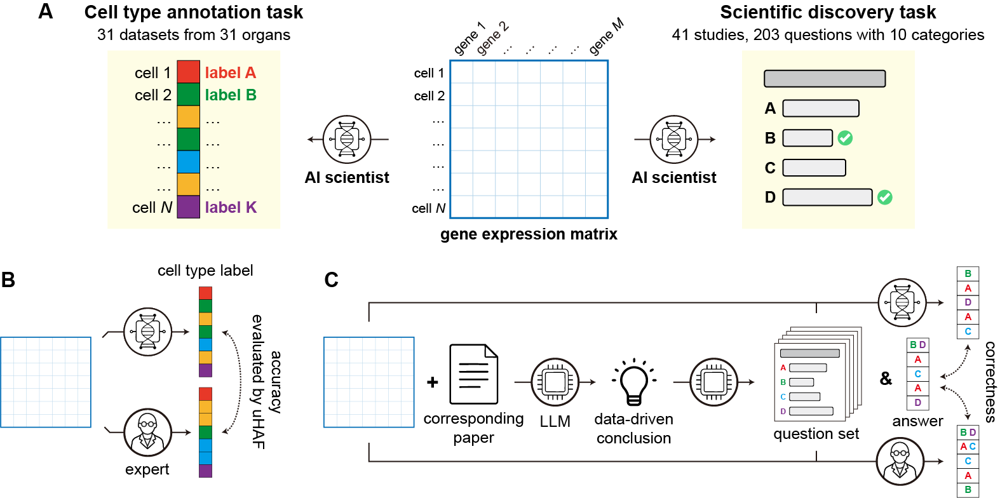

# Benchmarking the ability of the AI scientist for data-driven biological research

This is the repository of AI Scientist Benchmark (AISBench). This benchmark aims to evaluate the ability of AI Scientists in biology to make discoveries from real biological data. AISBench is constructed based on single-cell transcriptomic data (single-cell RNA sequencing data). It includes two parts: (1) Cell type annotation on 31 expert-labeled single-cell datasets. We developed a new evaluation metric that is based on a hierarchical cell type tree to comprehensively evaluate the annotation capability of AI Scientists. (2) Scientific discovery through answering 198 multiple-choice questions derived from the biological insights of 41 recent single-cell studies. The AI Scientists need to analyze the corresponding data and generate scientific insights aligned with actual scientific discoveries, and choose the right option for the question.



# Environment

```
scanpy
openai
numpy
pandas
huggingface_hub
uhaf
````

# Usage

**Task 1**
For the first task, you can run the `Task1.ipynb` to download the dataset and run the evaluation process for your AI scientist. We took CellTypist (a human annotation baseline) as an example in this script.

**Task 2**
For the second task, you can run the `Task2.ipynb` to get the dataset, research background information, and the multiple-choice questions (including reference answer). You can feed these to your AI scientist to evaluate their performance on real biological research scenario. We offer an example prompt in our manuscript, you can modify that to fit your AI scientist's requirement.

All the dataset used in this benchmark can be found at [Huggingface](https://huggingface.co/datasets/EperLuo/BAISBench).